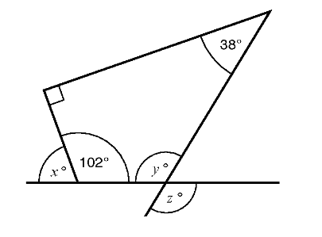
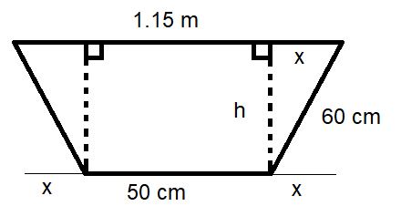
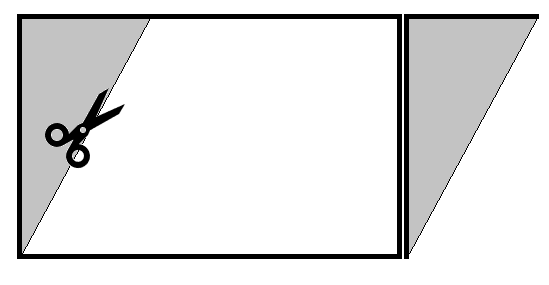
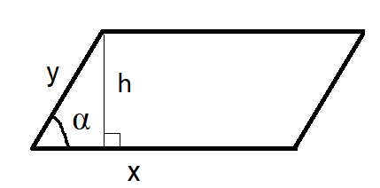
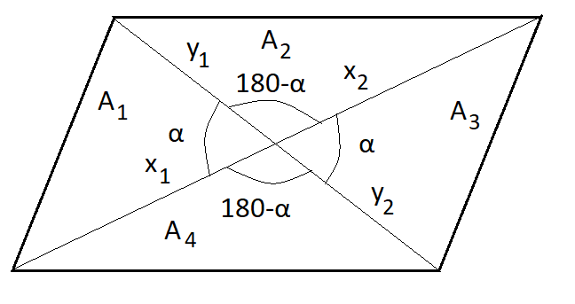
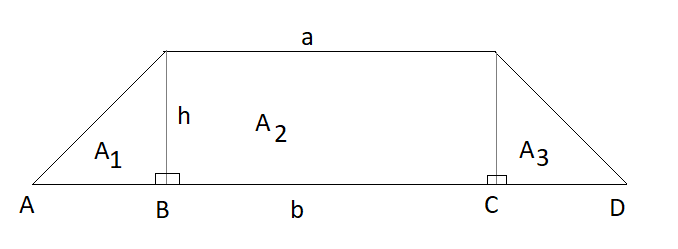

# Monikulmiot

Kolmiot ovat yksi erityistapaus monikulmioista. Yleisesti monikulmiota, jossa on $n$ kulmaa, sanotaan $n$-kulmioksi. Monikulmio on säännöllinen, jos sen kaikki sivut ovat keskenään yhtä pitkiä ja kaikki kulmat yhtä suuria, esim. neliö. Yleisesti $n$-kulmion kulmien summa on $(n-2) \cdot 180^{\circ}$. 

**Esim.** Määritä kuvassa olevien kulmien x,y ja z suuruudet. 

:::{admonition} Ratkaisu
:class: tip, dropdown

Nelikulmion kulmien summa on $(4-2) \cdot 180^{\circ}=360^{\circ}$. Tämän perusteella saadaan ratkaistua $y=(360-102-90-38)^{\circ}=130^{\circ}$.

Lisäksi saadaan selville kulman $y$ ristikulma $z=130^{\circ}$ ja 102 asteen kulman vieruskulma $x=180^{\circ}-102^{\circ}=78^{\circ}$.

:::

## Suunnikas ja puolisuunnikas

Nelikulmio, jonka vastakkaiset sivut ovat yhdensuuntaisia, on suunnikas. Jos suunnikkaan kaikki sivut ovat yhtä pitkät, se on neljäkäs. Nelikulmio, jonka kaksi vastakkaista sivua ovat yhdensuuntaisia, on puolisuunnikas. Tasakylkisessä puolisuunnikkaassa yhdensuuntaisten sivujen väliset sivut ovat yhtä pitkät.

**Esim.** Kuinka syvä on kuvan tasakylkinen oja?

:::{admonition} Ratkaisu
:class: tip, dropdown
 
Tasakylkisyyden perusteella saadaan $50~\text{cm}+2x=115~\text{cm}$, josta ratkeaa $x=\frac{115~\text{cm}-50~\text{cm}}{2}=32.5~\text{cm}$.

Korkeus $h$ saadaan nyt Pythagoraan lauseen avulla. Yksiköt on nyt jätetty pois yksinkertaisuuden takia.

$h^2+32.5^2=60^2$

$h^2=60^2-32.5^2$

$h=\sqrt{2543.75}$

$h=50.4$
:::

## Pinta-aloja

Suunnikkaalle, jonka korkeus on $h$ ja kannan pituus $a$, pätee sama pinta-alan $A$ kaava kuin suorakulmiolle eli $A=ah$. Kaavan voi helposti perustella leikkaamalla vaikkapa tavallisesta A4-paperiarkista palan siten, että paloista saa koottua suunnikkaan.

Suunnikkaan ala voidaan laskea myös kahden sivun ja niiden välisen kulman avulla: $A=xy \sin{\alpha}$.

:::{admonition} Perustelu
:class: tip, dropdown

Piirretään suunnikkaalle korkeus $h$. Korkeusjanan vasemmalle puolelle muodostuu suorakulmainen kolmio. Kulman $\alpha$ avulla voidaan ilmaista suunnikkaan korkeus muodossa $h=b \sin{\alpha}$. Tällöin pinta-alaksi tulee $A=ah = ab \sin{\alpha}$.

:::

Jos tiedetään suunnikkaan lävistäjät $x$ ja $y$ ja niiden välinen kulma $\alpha$, pinta-ala on $A=\frac{1}{2} xy \sin{\alpha}$. Laskukaava toimii yleisemminkin mille tahansa neliökulmiolle!

:::{admonition} Perustelu
:class: tip, dropdown

Ilmaistaan suunnikkaan lävistäjät kuvan merkinnöillä $x=x_1+x_2$ ja $y=y_1+y_2$. Suunnikkaan ala muodostuu neljästä kuvaan merkitystä kolmiosta, siis $A=A_1+A_2+A_3+A_4$. Kolmion aloille voidaan kirjoittaa ilmaisut sillä perusteella, että kolmion ala on kahden sivun pituuden tulo, kerrottuna sivujen välisen kulman sinillä, ja jaettuna kahdella:

$A_1=\frac{1}{2} x_1 y_2 \sin{\alpha}$, $A_2=\frac{1}{2} x_2 y_1 \sin{(180^{\circ}-\alpha)}$,

$A_3=\frac{1}{2} x_2 y_2 \sin{\alpha}$, $A_2=\frac{1}{2} x_1 y_2 \sin{(180^{\circ}-\alpha)}$.

Sinifunktiolla on ominaisuus $\sin{\alpha}=\sin{(180^{\circ}-\alpha)}$, joten yhtälöt muuttuvat muotoon

$A_1=\frac{1}{2} x_1 y_1 \sin{\alpha}$, $A_2=\frac{1}{2} x_2 y_1 \sin{\alpha}$, 

$A_3=\frac{1}{2} x_2 y_2 \sin{\alpha}$, $A_2=\frac{1}{2} x_1 y_2 \sin{\alpha}$.

Pinta-ala on yhteensä 

$A=A_1+A_2+A_3+A_4=$

$ \frac{1}{2} x_1 y_2 \sin{\alpha} + \frac{1}{2} x_2 y_1 \sin{\alpha} + \frac{1}{2} x_2 y_2 \sin{\alpha} + \frac{1}{2} x_2 y_2 \sin{\alpha}$

josta voidaan ottaa yhteiseksi tekijäksi $\frac{1}{2} \sin{\alpha}$:

$A=\frac{1}{2} \sin{\alpha} (x_1 y_1 + x_2 y_1 + x_2 y_2 + x_1 y_2)$.

Edelleen sulkujen sisällä olevaa lauseketta voi sieventää:

$A=\frac{1}{2} \sin{\alpha} \left(x_1 (y_1 + y_2) + x_2 (y_1 + y_2) \right)$.

Koska $y=y_1+y_2$, niin yhtälö sievenee muotoon

$A=\frac{1}{2} \sin{\alpha} \left(x_1 y + x_2 y \right)$.

Kun otetaankin nyt yhteiseksi tekijäksi $y$, yhtälöstä tulee

$A=\frac{1}{2} \sin{\alpha} \cdot y(x_1+ x_2)$ ja koska $x=x_1+x_2$, niin $A=\frac{1}{2} \sin{\alpha} xy$.

:::

Puolisuunnikkaalle, jonka yhdensuuntaisten sivujen pituudet ovat $a$ ja $b$ ja korkeus on $h$, pätee kaava $A=\frac{a+b}{2}\cdot h$.
  
:::{admonition} Perustelu
:class: tip, dropdown

Kaavan voi perustella esimerkiksi kuvan avulla seuraavasti. Puolisuunnikkaan sivujen pituudet ovat $a$ ja $b$. Piirretään lyhemmän vaakasuuntaisen sivun alusta ja lopusta korkeusjanat, jotka osuvat pidemmän vaakasuuntaisen sivun pisteisiin $B$ ja $C$. Merkitään lisäksi pidemmän vaakasuuntaisen sivun alkupistettä $A$ ja loppupistettä $D$. Nyt pitempi sivu voidaan esittää pisteiden välisien janojen summana: $a=AB+BC+CD$. Lisäksi todetaan kuvan perusteella, että $b=BC$.

Pinta-ala muodostuu kahdesta suorakulmaisesta kolmiosta $A_1$ ja $A_3$ sekä suorakulmiosta $A_2$, siis $A=A_1+A_2+A_3$. Voidaan kirjoittaa suoraviivaisesti yhtälö

$A=\frac{1}{2}AB\cdot h +BC\cdot h + \frac{1}{2} CD\cdot h$.

Otetaan yhteiseksi tekijäksi $\frac{1}{2} h$, jolloin yhtälö muuttuu muotoon

$A=\frac{1}{2} h \cdot (AB+2BC+CD)$.

Kirjoitetaan tämä hieman eri muodossa:

$A=\frac{1}{2} h \cdot (AB+BC+CD+BC)$.

Nyt voidaan sijoittaa kaavaan $AB+BC+CD=a$ ja $BC=b$, joten $A=\frac{1}{2} h \cdot (a+b)$.

:::
 
Yleisesti monikulmion pinta-ala voidaan laskea jakamalla se osiin, joiden pinta-ala voidaan laskea, eli käytännössä helpoiten suorakulmioihin ja suorakulmaisiin kolmioihin.

