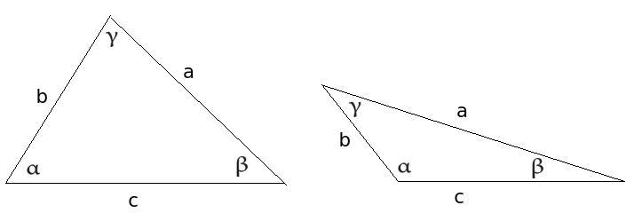
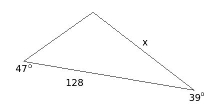
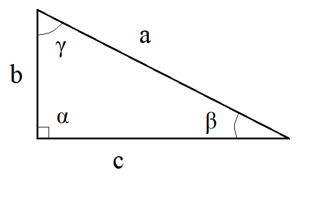
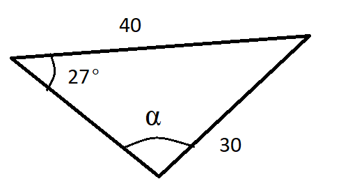
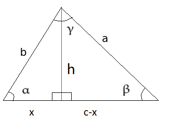
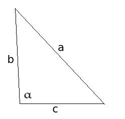

# Sini- ja kosinilause

Suorakulmaisten kolmioiden sivujen pituuksia ja kulmia saatiin selville Pythagoraan lauseen ja suorakulmaisen kolmion trigonometristen funktioiden avulla. Ne laskusäännöt eivät toimi yleisessä tapauksessa. Sen sijaan tässä luvussa esiteltävät yleisen kolmion laskukaavat toimivat myös suorakulmaisille kolmioille. 

Seuraavissa laskusäännöissä käytetään oheisen kuvan merkintöjä.

## Sinilause

Sinilause kuvaa kulmien ja niiden vastaisten sivujen suhteita. Lauseen mukaan kulman sinin ja kulman vastaisen sivun pituuden suhde on vakio, siis

$\frac{\sin{\alpha}}{a}=\frac{\sin{\beta}}{b}=\frac{\sin{\gamma}}{c}$. 

Sinilause voidaan esittää myös muodossa

$\frac{a}{\sin{\alpha}}=\frac{b}{\sin{\beta}}=\frac{c}{\sin{\gamma}}$.

Käytännössä sinilauseesta käytetään vain osaa kerrallaan. Jos tunnetaan kaksi sivua ja toisen vastainen kulma, voidaan ratkaista toisenkin sivun vastainen kulma. Vastaavasti jos tunnetaan kaksi kulmaa ja toista vastapäätä olevan sivun pituus, voidaan toisenkin sivun pituus selvittää. Kolmaskin kulma tietysti selviää, kun muistetaan, että kolmiot kulmat ovat yhteensä 180 astetta.

:::{admonition} Sinilauseen perustelu
:class: tip, dropdown

Kolmion alalle saatiin jo aiemmin määritelmä: ala on kahden sivun pituuksien tulo, kerrottuna sivujen välisen kulman sinillä, ja jaettuna kahdella. Kolmion pinta-alan pitää olla sama, olivatpa laskussa käytetyt kaksi sivua mitkä tahansa kolmion sivuista. Niinpä tulee olla

$\frac{1}{2} bc \sin {\alpha} = \frac{1}{2} ac \sin{\beta} = \frac{1}{2} ab \sin{\gamma}$.

Tarkastellaan kahden ensimmäisen lausekkeen yhtäsuuruutta:

$\frac{1}{2} bc \sin {\alpha} = \frac{1}{2} ac \sin{\beta}$

Kerrotaan molemmat puolet kahdella ja jaetaan molemmat puolet luvulla $c > 0$, jonka jälkeen yhtälö on sieventynyt muotoon

$b \sin{\alpha} = a \sin{\beta}$.

Yhtälö on muokattavissa muotoon $\frac{\sin{\alpha}}{a}=\frac{\sin{\beta}}{b}$.

Vastaavasti voidaan verrata 1. ja 3. lauseketta sekä 2. ja 3. lauseketta.

:::

::::{admonition} Esimerkki

Ratkaise sivun $a$  pituus, kun $b=10~\text{m}, \beta=35^{\circ}, \alpha=52^{\circ}$. Merkinnät ovat samat kuin sivun yläreunan kolmiossa.

:::{admonition} Ratkaisu
:class: tip, dropdown

Ratkaistaan sinilauseesta kysytty suure $a$:

$\frac{a}{\sin{\alpha}} = \frac{b}{\sin{\beta}} \leftrightarrow a = b \frac{\sin{\alpha}}{\sin{\beta}} \leftrightarrow a=10~\text{m} \frac{\sin{52^{\circ}}}{\sin{35^{\circ}}}=13.74~\text{m}$.

:::

::::

::::{admonition} Esimerkki

Ratkaise kulma $\alpha$, kun $a=80~\text{m}, c=95~\text{m}, \gamma=45^{\circ}$. Merkinnät ovat samat kuin sivun yläreunan kolmiossa.

:::{admonition} Ratkaisu
:class: tip, dropdown

Ratkaistaan kysytty suure $\alpha$ sinilauseesta. Yhtälön ratkaisu on lyhyempi, kun sinilause kirjoitetaan toisessa järjestyksessä kuin edellisessä esimerkissä.

$\frac{\sin{\alpha}}{a}=\frac{\sin{\gamma}}{c} \leftrightarrow \sin{\alpha}=\frac{a}{c} \sin{\gamma} \leftrightarrow \sin{\alpha}=\frac{80~\text{m}}{95~\text {m}}\cdot \sin{⁡45^{\circ}} \leftrightarrow \alpha \approx 36.5^{\circ}$.

:::

::::
 
::::{admonition} Esimerkki

Ratkaise kuviosta sivun $x$ pituus.

:::{admonition} Ratkaisu
:class: tip, dropdown
  
Sinilauseen käyttämiseksi pitäisi tietää ainoan tunnetun sivun vastaisen kulman suuruus. Koska kolmion kulmien summa on aina $180^{\circ}$, niin tuntematon kulma on $(180-47-39)^{\circ}=94^{\circ}$. Nyt sinilauseen perusteella

$\frac{128}{\sin{⁡94^{\circ}}}=\frac{x}{\sin{⁡47^{\circ}}}\leftrightarrow x = 128\cdot \frac{\sin{⁡47^{\circ}}}{\sin{⁡94^{\circ}}} \approx 94$.

:::

::::

:::{admonition} Soveltaminen suorakulmaiseen kolmioon
:class: tip, dropdown

Oletetaan, että kulma $\alpha$ olisikin suora, kuten kuvassa. Tällöin pätee $\sin{\alpha}=1$ ja sinilause sievenee muotoon 

$a=\frac{b}{\sin{\beta}}=\frac{c}{\sin{\gamma}}$

josta voidaan ratkaista $\sin{\beta}=\frac{b}{a}$ ja $\sin{\gamma}=\frac{c}{a}$

Laskukaavat ovat samat kuin suorakulmaisten kolmioiden yhtedessä opitut.

:::

:::{admonition} Huomautus arkussinistä
:class: tip, dropdown

Samaa sinin, kosinin tai tangentin arvoa vastaa itse asiassa äärettömän monta eri kulmaa. Käytännössä kolmioihin liittyvissä laskuissa arkussini voi tuottaa "väärän" vastauksen, sillä 0 ja 180 asteen väliltä löytyy aina kaksi kulmaa, joilla on sama sini. Niinpä jos tiedetään kulman sinin arvo $x$ ja ratkaistaan kulma $\alpha$, on ratkaisu tarkistettava, sillä kulmalle on kaksi vaihtoehtoa: $\alpha=\arcsin{x}$ ja $\alpha = 180^{\circ}-\arcsin{x}$.

**Esim.** Kulman sini on 0.9. Laskimella saadaan kulman suuruudeksi $\arcsin⁡{0.9}=64.16^{\circ}$. Toinen kulma, jonka sini on 0.9, on $180^{\circ}-\arcsin{⁡0.9}=180^{\circ}-64.16^{\circ}=115.84^{\circ}$.

:::

::::{admonition} Esimerkki

Ratkaise kuvan kolmiosta kulma $\alpha$.

:::{admonition} Ratkaisu
:class: tip, dropdown

Sinilauseen perusteella $\frac{\sin{\alpha}}{40}=\frac{\sin{27^{\circ}}}{30}$, josta ratkeaa $\sin{\alpha}=40\cdot \frac{\sin{27^{\circ}}}{30}$. Edelleen 

$\alpha=\arcsin{40\cdot \frac{\sin{27^{\circ}}}{30}}$,

josta laskin antaa tulokseksi $37.25^{\circ}$. Kuvan perusteella kuitenkin kulma $\alpha$ on tylppä, joten oikea vastaus onkin $\alpha=180^{\circ}-37.25^{\circ}=142.75^{\circ}$.

:::

::::

## Kosinilause

Kosinilause on laskusääntö, jonka mukaan tietyn kulman kyljet, kulman vastainen sivu ja kulman kosini ovat yhteydessä toisiinsa seuraavien yhtälöiden mukaisesti:
 
- $c^2=a^2+b^2-2ab \cos{\gamma}$
- $b^2=a^2+c^2-2ac \cos⁡{\beta}$
- $a^2=b^2+c^2-2bc \cos{\alpha}$

Yhtälöiden oikealle puolelle tulee siis aina yhtälön vasemmalla puolella olevaa sivua vastapäätä oleva kulma.

:::{admonition} Kosinilauseen perustelu
:class: tip, dropdown

Kosinilause voidaan perustella piirtämällä kolmioon korkeusjana ja ilmaisemalla sen pituus $h$ kahdella eri tavalla. Korkeus ilmaistaan nyt Pythagoraan lauseen avulla kahdessa eri kolmiossa. Korkeuden pitää olla sama molemmilla tavoilla ilmaistuna. Tästä seuraa, että myös korkeuden toisen potenssin $h^2$ tulee olla sama. Tällä ei ole muuta merkitystä kuin se, että laskusta tulee hieman lyhyempi.

Korkeusjana jakaa kolmion kannan $c$ osiin $x$ ja $c-x$. Vasemmalle puolelle muodostuvasta suorakulmaisesta kolmiosta nähdään, että $\cos{\alpha}=\frac{x}{b}$, joten $x=b\cos{\alpha}$. Niinpä kanta jakautuu osiin $b \cos{\alpha}$ ja $c-b\cos{\alpha}$.

Ratkaistaan nyt korkeusjanan $h$ toinen potenssi $h^2$ Pythagoraan lauseen avulla vasemmanpuoleisen kolmion merkinnöin:

$(b \cos{\alpha})^2 + h^2 = b^2$, josta seuraa $h^2 = b^2 - (b \cos{\alpha})^2 = b^2 - b^2 \cos^2{\alpha}$.

Oikeanpuoleisesta kolmiosta saadaan vastaavasti

$(c-b \cos{\alpha})^2 + h^2 = a^2$, josta saadaan binomikaavan avulla

$c^2 -2bc \cos{\alpha} + b^2 \cos^2{\alpha} + h^2 = a^2$

ja edelleen

$h^2 = a^2 - c^2 + 2bc \cos{\alpha} - b^2 \cos^2{\alpha}$

Nyt yhtälöiden oikeiden puolien pitää olla samat:

$b^2-b^2 \cos^2{\alpha}=a^2-c^2+2bc \cos{\alpha}-b^2 \cos^2{\alpha}$

Lisätään yhtälön molemmille puolille $b^2 \cos^2{\alpha}$, jolloin yhtälö sievenee muotoon

$b^2=a^2-c^2+2 bc \cos{\alpha}$

josta voidaan ratkaista

$a^2 = b^2+c^2-2bc \cos{\alpha}$.

Vastaavasti voidaan johtaa kosinilause piirtämällä korkeusjana jostakin muusta kärjestä sitä vastaavalle kannalle.

:::

::::{admonition} Esimerkki

Ratkaise kuvan kolmiosta sivu $a$, kun tiedetään, että $b=389, c=372, \alpha={91.9^{\circ}}$.

:::{admonition} Ratkaisu
:class: tip, dropdown

Kosinilauseen nojalla $a^2=b^2+c^2-2bc \cos⁡{\alpha}$, joten $a^2=389^2+372^2-2\cdot 389\cdot 372 \cos⁡{91.9^{\circ}}$, josta saadaan $a^2=299300.639$ ja edelleen $a=547$.
:::

::::
 
::::{admonition} Esimerkki

Kuinka suuret ovat kolmion kulmat $\alpha, \beta, \gamma$, kun sivujen pituudet ovat $a=10, b=7, c=5$?

:::{admonition} Ratkaisu
:class: tip, dropdown

Ratkaistaan ensin kulma $\alpha$ kirjoittamalla kosinilause siten, että yhtälön toiselle puolelle tulee kulma $\alpha$ ja toiselle puolelle kyseistä kulmaa vastapäätä oleva sivu $a$.

$a^2=b^2+c^2-2bc \cos{\alpha}$

$b^2+c^2-2bc \cos{\alpha}=a^2$

$-2bc \cos{\alpha}=a^2-b^2-c^2$

$\cos{\alpha}=\frac{a^2-b^2-c^2}{-2bc}$

$\cos{\alpha⁡}=\frac{10^2-7^2-5^2}{-2\cdot 7 \cdot 5}$

$\cos{\alpha} = -0.371$

$\alpha=\arccos{-0.371}$

$\alpha = 111.8^{\circ}$.

Kulman $\beta$ voi ratkaista vastaavalla tavalla kosinilauseella:

$b^2=a^2+c^2-2ac \cos{\beta}$

$\cos{\beta}=\frac{b^2-a^2-c^2}{-2ac}$

$\cos{\beta}=\frac{7^2-10^2-5^2}{-2\cdot 10 \cdot5}$

$\cos{\beta} = 0.76$$

$\beta = \arccos{⁡0.76}$

$\beta=40.5^{\circ}$.

Kulman ratkaisu onnistuisi myös sinilauseella:

$\frac{\sin{\beta}}{7}=\frac{\sin{\alpha}}{10}$

$\beta=\arcsin{\sin{111.8^{\circ}}\frac{7}{10}}$

$\beta = 40.5^{\circ}$

Kolmas kulma saadaan helposti vähennyslaskulla: $\gamma=(180-111.8-40.5)^{\circ}=27.7^{\circ}$.

:::

::::

:::{admonition} Soveltaminen suorakulmaiseen kolmioon
:class: tip, dropdown

Oletetaan, että kulma $\alpha$ on suora, kuten kuvassa. Suoralle kulmalle pätee $\cos{\alpha}=0$. Sijottamalla tämä kosinilauseeseen saadaan 
$a^2=b^2+c^2-2bc\cdot 0$ eli $a^2=b^2+c^2$, toisin sanoen Pythagoraan lause.

:::