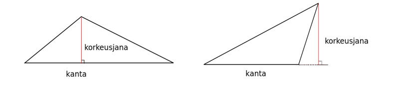
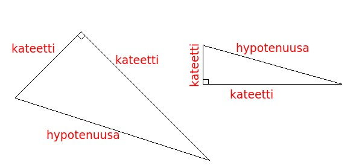
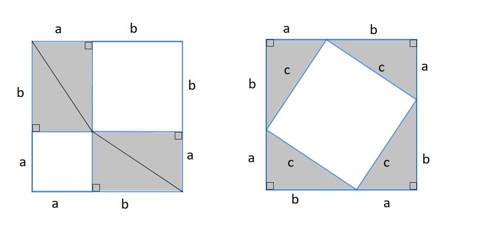
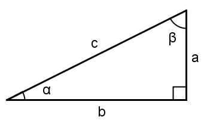
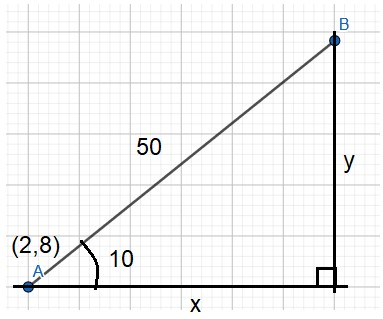

#  Suorakulmaiset kolmiot

Kolmiot liittyvät hyvin monenlaisiin geometrisiin ongelmiin. Kolmiossa on kolme toisiinsa yhdistyvää sivua, joiden välille muodostuvat kolmion kolme kulmaa. Kolmion korkeusjana on kärjestä kohtisuoraan vastakkaiselle sivulle tai sen jatkeelle piirretty jana. Vastakkaista sivua sanotaan kannaksi. Kolmion sivujen väliset kulmat voivat olla kaikki teräviä, tai yksi kulmista voi olla tylppä. Erityistapaus on suorakulmainen kulmio, jonka kulmista yksi on suora ja muut teräviä. Kolmion kulmien summa on aina 180 astetta.

Minkä tahansa kolmion pinta-ala $A$ lasketaan kaavalla $A=\frac{ah}{2}$, missä $a$ on kannan pituus ja $h$ korkeusjanan pituus (riippumatta siitä, onko korkeusjana kannalla vai kannan jatkeella).

Suorakulmaiset kolmiot ovat erityistapaus kolmioista. Suoran kulman viereisten sivujen nimi on kateetti. Suorakulmaisen kolmion kanta ja korkeusjana ovat samat kuin kolmion kateetit, joten pinta-ala on kateettien tulo jaettuna kahdella. Suoran kulman vastainen sivun nimi on hypotenuusa. Se on suorakulmaisen kolmion pisin sivu. Suorakulmaisille kolmioille on olemassa omia laskusääntöjä, joita ei voida soveltaa muihin kolmioihin. 

 
## Pythagoraan lause

Suorakulmaiselle kolmiolle pätee Pythagoraan lause: hypotenuusan pituuden neliö on kateettien pituuksien neliöiden summa. Jos kateettien pituudet ovat $a$ ja $b$ ja hypotenuusan pituus on $c$, niin Pythagoraan lause voidaan kirjoittaa muodossa $c^2=a^2+b^2$.

:::{admonition} Pythagoraan lauseen perustelu
:class: tip, dropdown

Pythagoraan lauseelle on olemassa useita perusteluja. Tässä eräs niistä:

Kuvassa olevan neliön sivun pituus on $a+b$. Jaetaan neliö palasiin kahdella eri tavalla. Vasemmanpuoleisessa kuvassa muodostetaan neliön nurkkiin suorakulmaisia kolmioita: kummassakin nurkassa on kaksi suorakulmaista kolmiota, joiden kateetit ovat $a$ ja $b$. Merkitään hypotenuusaa kirjaimella $c$. Keskelle jäävän pienemmän valkoisen neliön pinta-ala on sivujen pituuksien tulo, siis $c\cdot c=c^2$.

Siirretään sitten kolmiot jokainen omaan nurkkaansa. Näidenkin neliöiden kateetit ovat $a$ ja $b$. Valkoisen pienemmän neliön pinta-ala on nyt $a^2$ ja isomman neliön pinta-ala on $b^2$.  Valkoiseksi alueesta jää nyt yhteensä $a^2+b^2$.

Lopuksi verrataan kuvia: kummassakin tapauksessa kolmiot ovat aivan yhtä suuret, joten kolmiot vievät yhtä paljon tilaa riippumatta siitä kummalla tavalla ne on ison neliön sisälle aseteltu. Valkoiseksi jäävä alue on tällöin kummassakin kuvassa yhtä suuri. Voidaan kirjoittaa: $a^2+b^2=c^2$.

:::

**Esim.** Laske suorakulmaisen kolmion hypotenuusan pituus, kun kateettien pituudet ovat 5 cm ja 3 cm.

:::{admonition} Ratkaisu
:class: tip, dropdown

Sijoitetaan kateettien pituudet ja tuntematon hypotenuusan pituus Pythagoraan lauseeseen ja ratkaistaan yhtälö: 

$c^2=5^2+3^2$

$c^2=25+9$

$c=\sqrt{34}$

:::

**Esim.** Laske suorakulmaisen kolmion toisen kateetin pituus, kun hypotenuusan pituus on 10 cm ja toisen kateetin pituus on 2 cm.

:::{admonition} Ratkaisu
:class: tip, dropdown

Sijoitetaan tunnetut arvot Pythagoraan lauseeseen. Ei ole väliä, merkitäänkö tuntematonta kateettia $a$ vai $b$.

$10^2=2^2+b^2$

$-b^2=-10^2+2^2$

$b^2=10^2-2^2$

$b^2=100-4$

$b=\sqrt{96}$

:::

**Esim.** Suorakulmaisen kolmion kaksi sivua ovat pituudeltaan 6 m ja 8 m. Laske kolmannen sivun pituus.

:::{admonition} Ratkaisu
:class: tip, dropdown

Tässä tapauksessa ei tiedetä, ovatko annetut sivut kolmion kateetit vai onko toinen niistä hypotenuusta. Ratkaistaan tehtävä kumpikin vaihtoehto huomioiden.

(1) Oletetaan, että annetut sivut ovat kateetteja. Tällöin hypotenuusan pituus on $c=\sqrt{6^2+8^2}=\sqrt{100}=10$.

(2) Oletetaan, että annetuista sivuista pitempi on hypotenuusa (lyhyempi sivu ei voi olla hypotenuusa, koska hypotenuusa on suorakulmaisen kolmion pisin sivu). Tällöin on ratkaistava yhtälö

$8^2 = 6^2 + b^2$

$b^2 = 8^2 - 6^2$

$b^2 = 28$

$b=\sqrt{28}$

:::

**Esim.** Kolmion sivut ovat pituudeltaan 4, 5 ja 7. Onko kyseinen kolmio suorakulmainen?

:::{admonition} Ratkaisu
:class: tip, dropdown

Tarkistetaan, pitääkö Pythagoraan lause paikkansa näillä arvoilla. Kateettien neliöiden summa on $4^2 + 5^2 = 16+25 = 41$. Hypotenuusan neliö on $7^2 = 49$. Luvut eivät ole yhtä suuret, joten kolmio ei ole suorakulmainen.

:::

**Esim.** Millä luvun $a > 2 $ arvolla kolmio, jonka sivut ovat $x$, $2x$ ja $ax$, olisi suorakulmainen?

:::{admonition}
:class: tip, dropdown

Kirjoitetaan Pythagoraan lause ja ratkaistaan yhtälöstä kerroin $a$. Huomaa, että nyt kirjain $a$ ei tarkoita kateettia, vaan kerrointa kolmion sivun pituudessa. Koska tehtävässä on kerrottu, että $a > 2$, niin sivu $ax$ on pitempi kuin kumpikaan muista annetuista sivuista, ja siten kolmion hypotenuusta. Kirjoitetaan Pythagoraan lause ja ratkaistaan $a$:

$(ax)^2 = x^2 + (2x)^2$

$a^2 x^2 = x^2 + 4x^2$

$a^2 x^2 = 5x^2 $

$a^2 = 5$

$a= \sqrt{5}$

:::

**Esim.** Suorakulmaisen kolmion hypotenuusa on 3 kertaa niin pitkä kuin toinen kateetti. Selvitä toisen kateetin pituus.

:::{admonition} Ratkaisu
:class: tip, dropdown

Merkitään kateettia vaikkapa kirjaimella $a$. Tällöin hypotenuusa on $3a$. Ratkaistaan toisen kateetin pituus $b$ Pythagoraan lauseesta:

$(3a)^2 = a^2 + b^2$

$9a^2 = a^2 + b^2 $

$b^2 = 8a^2 $

$b = \sqrt{8a^2}$

$b= \sqrt{8} a$

Kummankaan kateetin lukuarvoa ei siis tehtävänannon perusteella tiedetä, mutta saatiin selville, että toinen kateetti on $\sqrt{8}$ kertaa niin pitkä kuin toinen. On olemassa äärettömän monta kolmiota, jotka täyttävät annetut ehdot. Jos yksi kateetti on 1 metrin pituinen, niin toinen on $1\cdot \sqrt{8} \approx 2.83$ m ja hypotenuusa 3 m.

:::

## Suorakulmaisen kolmion trigonometriset funktiot

Suorakulmaisen kolmion teräville kulmille on määritelty kolme ns. trigonometrista funktiota:
- Kulman sini (sin) on kulman vastaisen kateetin pituuden suhde hypotenuusan pituuteen
- Kulman kosini (cos) on kulman viereisen kateetin pituuden suhde hypotenuusan pituuteen
- Kulman tangentti (tan) on kulman vastaisen kateetin pituuden suhde viereisen kateetin pituuteen

Kuvan merkinnöillä voidaan kirjoittaa:
 
- $\sin{\alpha}=\frac{a}{c}, \sin{\beta}=\frac{b}{c}$
- $\cos{\alpha}=\frac{b}{c}, \cos{\beta}=\frac{a}{c}$
- $\tan{\alpha}=\frac{a}{b}, \tan{\beta}=\frac{b}{a}$

Sinin ja kosinin arvot ovat suorakulmaisissa kolmioissa lukujen 0 ja 1 välissä. Tangentit voivat saada muitakin positiivisia arvoja. Kun tiedetään kulman sinin, kosinin tai tangentin arvo, saadaan kulman suuruus ratkaistua laskimen arkusfunktioiden avulla. Laskimessa arkusfunktioita voidaan merkitä eri tavoin: arcsin/arccos/arctan, asin/acos/atan, sin-1/cos-1/tan-1. [WolfamAlpha](https://wolframalpha.com) ymmärtää komennot "arcsin" ja "asin" (sekä vastaavat kosinille ja tangentille).

**Esim.** Ratkaistaan kulma $\alpha$, kun $\sin{\alpha}=0.562$. Tällöin $\alpha=\arcsin{⁡0.562}=34.2^{\circ}$.

**HUOM!** Jos tiedetään kulman sinin arvo $x$ ja ratkaistaan kulma $\alpha$, on ratkaisu tarkistettava, sillä arkussinifunktion ominaisuuksista johtuen kulmalle on kaksi vaihtoehtoa: $\alpha=\arcsin{x}$ ja $\alpha = 180^{\circ}-\arcsin{x}$.

**Esim.** Kulman sini on 0.9. Laskimella saadaan kulman suuruudeksi $\arcsin⁡{0.9}=64.16^{\circ}$. Toinen kulma, jonka sini on 0.9, on $180^{\circ}-\arcsin{⁡0.9}=180^{\circ}-64.16^{\circ}=115.84^{\circ}$.

**Esim.** Ratkaise oheisen kolmion tuntemattomat osat, kun tiedetään, että $c=12.3$ m ja $\alpha=38.0^{\circ}$.

:::{admonition} Ratkaisu
:class: tip, dropdown
 
Sivut $a$ ja $b$ saadaan selville kulman $\alpha$ trigonometristen funktioiden avulla:

$\sin{\alpha}=\frac{a}{c}$

$a=c\sin{\alpha}$

$a=12.3~\text{m}\cdot \sin{⁡38.0^{\circ}}$

$a=7.57~\text{m}$

ja

$\cos{\alpha} = \frac{b}{c}$

$b=c\cdot \cos⁡{\alpha}$

$c=12.3~\text{m}\cdot \cos{⁡38.0^{\circ}}$

$c=9.69~\text{m}$

Toinen tuntematon kulma saadaan selville sen tiedon perusteella, että kolmion kulmien summa on 180 astetta: 

$\beta=180^{\circ}-90^{\circ}-38.0^{\circ}=52.0^{\circ}$.

Sama ratkaisu saataisiin myös trigonometrisia funktioita hyödyntämällä.

:::

**Esim.** Ratkaise suorakulmaisen kolmion tuntemattomat osat, kun tiedetään, että kateettien pituudet ovat $a=3.54~\text{m}$ ja $b=4.36~\text{m}$.

:::{admonition} Ratkaisu
:class: tip, dropdown

Tuntemattomia osia ovat hypotenuusa sekä terävien kulmien suuruudet. Pythagoraan lauseen avulla saadaan hypotenuusan pituus:

$c^2=a^2+b^2$

$c=\sqrt{a^2+b^2}$

$c=\sqrt{(3.54~\text{m})^2+(4.36~\text{m})^2}$

$c=\sqrt{31.5412~\text{m}^2}$

$c\approx 5.62~\text{m}$.

Kulmien selvittämiseen hyödynnetään arkustangenttia sekä tietoa, että terävien kulmien summa on $90^{\circ}$:

$\tan{\alpha}=\frac{a}{b}$

$\tan{\alpha}=\frac{3.54~\text{m}}{4.36~\text{m}}$

$\alpha=\arctan⁡\left(\frac{3.54}{4.36}\right)\approx 39.1^{\circ}$

$β=90^{\circ}-39.1^{\circ} = 50.9^{\circ}$.

:::

**Esim.** Suorakulmaisen kolmion kateetit ovat $x$ ja $4x$. Selvitä kolmion kulmien suuruudet.

:::{admonition} Ratkaisu
:class: tip, dropdown

Lyhyempää sivua vastapäätä olevan kulman $\alpha$ tangentti on $\tan{\alpha} = \frac{x}{4x}$. Kulma saadaan laskemalla $\alpha = \arctan{\frac{x}{4x}}= \arctan{\frac{1}{4}} \approx 14.04^{\circ}$. Kolmas kulma $\beta$ on $180^{\circ}-90^{\circ}-14.04^{\circ} = 75.96^{\circ}$. Sama tulos saataisiin myös tämän kulman tangentin avulla: $\beta = \arctan{\frac{4x}{x}}= \arctan{4} \approx 75.96^{\circ}$.

:::

## Suorakulmainen koordinaatisto

Eräs suorakulmaisten kolmioiden sovellus on kaksiulotteinen suorakulmainen koordinaatisto. Se koostuu kahdesta lukusuorasta: ”x-akseli” ja ”y-akseli”. Lukusuoran kasvavaa suuntaa merkitään nuolella. Pisteen paikka $A$ ilmoitetaan muodossa $A=(x,y)$. Pisteellä $(0,0)$ on erityisnimitys origo.

**Esim.** Kuvassa $A=(4,6)$, $B=(10,-2)$, $C=(-4,-2)$ ja $D=(-4,8)$.
   
Pisteiden etäisyys origosta saadaan Pythagoraan lauseella, kun täydennetään kuvio suorakulmaiseksi kolmioksi. Pythagoraan lauseeseen voi sijoittaa myös negatiivisia koordinaattien arvoja.

**Esim.** Mitkä ovat edellisen kuvan pisteiden $A$ ja $D$ etäisyydet origosta?

:::{admonition} Ratkaisu
:class: tip, dropdown
Pisteen $A$ etäisyys saadaan ratkaisemalla yhtälö:

$r^2=4^2+6^2$

$r=\sqrt{4^2+6^2}$

$r\approx 7.2$

Pisteen $D$ etäisyys on vastaavasti $\sqrt{(-4)^2+8^2} = \sqrt{16+64} = \sqrt{80} \approx 8.94$.
:::

Kahden pisteen välisen etäisyyden laskemiseksi tarvitaan pisteiden x-koordinaattien erotus $\Delta x$ ja y-koordinaattien erotus $\Delta y$. Sen jälkeen sovelletaan näille etäisyyksille Pythagoraan lausetta. Koordinaattien erotukset saadaan vähentämällä ensimmäisen pisteen koordinaatit jälkimmäisistä. Erotuksen voi myös päätellä: kuinka monta askelta x-suunnassa täytyy siirtyä, jotta päästään ensimmäisen pisteet x-koordinaatista jälkimmäisen pisteen x-koordinaattiin? Entä kuinka monta askelta tarvitaan y-suunnassa?

**Esim.** Laske pisteiden $A=(4,6)$ ja $D=(-4,8)$ etäisyys.

:::{admonition} Ratkaisu
:class: tip, dropdown

Aluksi lasketaan x-koordinaattien ero: $\Delta x = -4-4=-8$, ja y-koordinaattien ero: $\Delta y = 8-6=2$. Sama tulos saadaan päättelemällä: pisteestä $(4,6)$ pitää siirtyä vaakasuunnassa 8 yksikköä taaksepäin ja 2 yksikköä ylöspäin, jotta päästään pisteeseen $(-4,8)$. Pisteiden välinen etäisyys on siis $\sqrt{(-8)^2+2^2}=\sqrt{68}\approx 8.24$.
:::

Pisteiden välinen suuntakulma saadaan täydentämällä koordinaatistoon suorakulmainen kolmio ja hyödyntämällä trigonometrisiä funktioita. Matematiikassa käytäntö on, että suuntakulma mitataan positiivisesta x-akselista vastapäivään. Esimerkiksi suunnistuksessa kulma voidaan määritellä eri tavalla.

**Esim.** Pisteestä $A=(10,0)$ liikutaan pisteeseen $B=(25,8)$. Miten pitkä matka siirryttiin ja mihin suuntaan?

:::{admonition} Ratkaisu
:class: tip, dropdown

Siirtymän suuruus on $\sqrt{(25-10)^2+(8-0)^2} = \sqrt{15^2+8^2} = \sqrt{289} = 17$.

Suuntakulmalle $\alpha$ pätee $\tan{\alpha}=\frac{\Delta y}{\Delta x}$, josta saadaan ratkaistua $\alpha=\arctan{\frac{8-0}{25-10}}=\arctan{\frac{8}{15}} \approx 28.1^{\circ}$.
:::
 
**Esim.** Pisteestä $A=(2,8)$ liikutaan 50 yksikköä 10 asteen suuntakulmassa. Mihin pisteeseen $B$ päädytään?

:::{admonition} Ratkaisu
:class: tip, dropdown

Kuvaan täydennetylle suorakulmaiselle kolmiolle pätee: $\cos{⁡10^{\circ}}=\frac{\Delta x}{50}$, $\sin{⁡10^{\circ}}=\frac{\Delta y}{50}$. Siis $\Delta x=50\cdot \cos{⁡10^{\circ}}=49.2^{\circ}$ ja $\Delta y=50\cdot \sin{⁡10^{\circ}}=8.7^{\circ}$. 

Pisteen $B$ koordinaatit saadaan lisäämällä x- ja y-suuntainen siirtymä pisteen $A$ koordinaatteihin: $B=(2+49.2, 8+8.7)=(51.2,16.7)$.
:::
