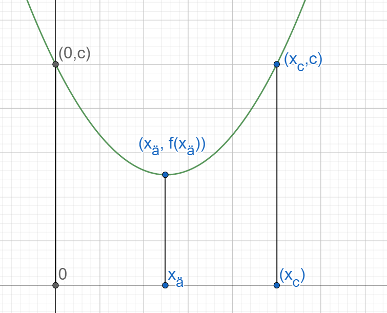

# Toisen asteen polynomimalli

Toisen asteen polynomimalli on muotoa $f(x)=ax^2+bx+c$ tai $y=ax^2+bx+c$. Tällaisen mallin kuvaama asia ei kasva tai pienene tasaisesti, vaan kasvu- tai pienenemisnopeus vaihtelee. Lisäksi mallilla on jokin minimi- tai maksimikohta. Tällaiset matemaattiset mallit liittyvätkin usein tapauksiin, joissa halutaan löytää yhtälön kuvaamalle ilmiölle mahdollisimman pieni tai suuri arvo.

## Funktion muoto

Funktion kuvaaja on ylöspäin aukeava paraabeli ("kuoppa"), jos $a>0$, ja alaspäin aukeava paraabeli ("mäki"), jos $a<0$. Vakion $a$ itseisarvo vaikuttaa kuvaajan terävyyteen. Vakio $c$ kertoo paraabelin ja $y$-akselin leikkauspisteen, sillä $f(0)=a\cdot 0^2 + b\cdot 0 +c = c$. Vakio $b$ liittyy kuvaajan sijaintiin, mutta sen arvosta ei suoraan näe esimerkiksi sitä, missä kohti on "kuopan pohja" tai "mäen huippu". Seuraavassa kuvassa on esimerkkejä kuvaajista, jotka vastaavat erilaisia funktioita.

Aiemmin toisen asteen yhtälöiden yhteydessä todettiin, että toisen asteen yhtälöllä $ax^2+bx+c=0$ voi olla 0, 1 tai 2 ratkaisua. Toisin sanoen funktio $f(x)=ax^2+bx+c$ voi saada arvon nolla 0, 1 tai 2 eri $x$:n arvolla. Näitä $x$:n arvoja sanotaan polynomin nollakohdiksi, ja niitä voi siis olla 0, 1 tai 2 kappaletta riippuen polynomin kertoimista $a$, $b$ ja $c$. Tällöin on olemassa seuraavassa kuvassa esitetyt kuusi eri vaihtoehtoa sille, miltä polynomin kuvaaja voi näyttää.

Periaatekuvan hahmottelu auttaa päättelemään, milloin funktio saa positiivisia ja milloin negatiivisia arvoja ilman, että funktion varsinaisia arvoja tarvitsee laskea. Riittää, että selvittää nollakohdat ja paraabelin suunnan kertoimen $a$ avulla.

::::{admonition} Esimerkki

Millä muuttujan $x$ arvoilla funktio $f(x)=3x^2-3x-6$ saa positiivisia arvoja?

:::{admonition} Ratkaisu
:class: tip, dropdown

Funktion nollakohdat ovat toisen asteen ratkaisukaavalla laskettuna

$x = \frac{-(-3)\pm\sqrt{(-3)^2-4\cdot 3 \cdot (-6)}}{2\cdot 3}$

$x = \frac{3\pm\sqrt{9+72}}{6}$

$x = \frac{3\pm 9}{6}$

eli $x=\frac{12}{6}=2$ ja $x=-\frac{6}{6}=-1$.

Koska kerroin $a=3$ on positiivinen, kuvaaja on samankaltainen kuin edellisen taulukon ylärivin oikeassa reunassa. Niinpä funktion arvot ovat negatiivisia, kun $-1 < x < 2$, ja positiivisia kaikilla muilla $x$:n arvoilla.

:::

::::

## Funktion muodostaminen

Toisen asteen polynomifunktion lausekkeen voi muodostaa, jos funktiosta tiedetään nollakohdat. Jos funktiolla on vain yksi nollakohta, se riittää. Lisäksi funktiosta täytyy tietää yksi muu piste.

Jos funktion nollakohdat ovat $x_1$ ja $x_2$, niin funktion lauseke saadaan purkamalla auki lauseke $a(x-x_1)(x-x_2)$. Sulkulausekkeiden kertolaskusta saadaan polynomien laskukaavan perusteella:

$(x-x_1)(x-x_2)=x^2-x_1x-x_2x+x_1x_2=x^2-(x_1+x_2)x+x_1x_2$

Toisin sanoen kerrointa $b$ vastaa nollakohtien summan $x_1+x_2$ vastaluku, ja kerrointa $c$ vastaa nollakohtien tulo. Jos nollakohtia on vain yksi, se sijoitetaan lausekkeeseen sekä $x_1$:n että $x_2$:n paikalle.

Edellisestä laskusta ei vielä selvinnyt vakion $a$ arvo. Se saadaan ratkaistua, jos tiedetään jokin funktion arvo $f(x)=y$, missä $y\neq 0$.

::::{admonition} Esimerkki

Muodosta toisen asteen polynomifunktioiden lausekkeet, kun niistä tiedetään seuraavaa:

a) Funktion nollakohdat ovat -2 ja 3, ja eräs piste funktion kuvaajasta on $f(1)=5$.

b) Funktiolla on yksi nollakohta $x=4$, ja $f(0)=7$.

:::{admonition} Ratkaisu
:class: tip, dropdown

a) Funktion lauseke on $a(x-(-2))(x-3)$ joka sievenee muotoon $a(x+2)(x-3)$ ja edelleen potenssilaskusääntöjen mukaisesti muotoon $a(x^2-3x+2x-6)$ eli sievennettynä $a(x^2-x-6)$.

Suluissa oleva lauseke saadaan myös muodostettua suoraan nollakohtien avulla: muuttujan $x$ kerroin on $-(-2+3)=-1$, ja vakiotermi on $-2\cdot 3=-6$.

Vakion $a$ arvo saadaan selville yhtälöstä $f(1)=5$:

$a(1^2-1-6)=5 \Leftrightarrow -6a=5 \Leftrightarrow a=-\frac{5}{6}$.

Funktion lauseke on siis

$f(x)=-\frac{5}{6}(x^2-x-6)=-\frac{5}{6}x^2-\frac{5}{6}x+5$.

b) Funktion lauseke on muotoa $a(x-4)(x-4)$ eli $a(x-4)^2$, joka erotuksen neliön kaavalla muokkautuu muotoon $a(x^2-8x+16)$.

Kertoimet saadaan myös suoraan: $b=-(4+4)=-8$ ja $c=4\cdot 4 = 16$.

Vakion $a$ arvo saadaan selville yhtälöstä $f(0)=7$:

$a(0^2-8\cdot 0 +16)=7 \Leftrightarrow 16a=7 \Leftrightarrow a=\frac{7}{16}$.

Lausekkeeksi saadaan siis 

$f(x)=\frac{7}{16}x^2-\frac{7}{2}x+7$.

:::
::::

## Ääriarvot

Ylöspäin aukeavalle paraabelille voidaan löytää pienin mahdollinen arvo ("kuopan pohja"), ja alaspäin aukeavalle paraabelille voidaan löytää suurin mahdollinen arvo ("mäen huippu"). 

Minimi- tai maksimikohdan x-koordinaatti voidaan laskea yhtälöstä $2ax+b=0$ ja vastaava minimi- tai maksimiarvo $y$ saadaan sijoittamalla kyseinen $x$:n arvo polynomimallin lausekkeeseen. Kyseistä $x$:n arvoa sanotaan funktion ääriarvokohdaksi (tai minimikohdaksi tai maksimikohdaksi) ja vastaavaa polynomin arvoa funktion ääriarvoksi (tai minimiarvoksi tai maksimiarvoksi).

Ääriarvon voi laskea myös suoraan kaavalla $y=c-\frac{b^2}{4a}$.

:::{admonition} Laskukaavojen perustelu
:class: tip, dropdown

Kuvassa vihreällä on toisen asteen polynomifunktio $f(x)=ax^2+bx+c$. Selvästi funktiolla on ääriarvo (tässä tapauksessa pienin mahdollinen arvo) $f(x_ä)$ ja tämän arvon funktio saa, kun $x=x_ä$.

Ääriarvokohta $x_ä$ on puolivälissä niitä pisteitä, joissa funktion arvo on $c$. (Myös mikä tahansa muu arvo kelpaisi, mutta $c$ selviää heti funktion lausekkeesta!) Etsitään siis pisteet $x_c$, joissa funktion arvo on $c$, ratkaisemalla yhtälö $ax_c^2+bx_c+c=c$:

$ax_c^2+bx_c=0$

$x_c (ax_c+b)=0$

Tulon nollasäännön perusteella $x_c=0$ tai $ax_c+b=0$. Ensimmäinen vaihtoehto ei kelpaa vastaukseksi, sillä jo funktion lausekkeesta tiedetään, että funktion arvo on $c$, kun $x=0$. Ratkaisu saadaan siis yhtälöstä $ax_c+b=0$:

$ax_c=-b$

$x_c=-b/a$

Ääriarvokohta $x_ä$ on keskiarvo luvuista $0$ ja $x_c$:

$x_ä=\frac{0+x_c}{2}$

$x_ä=-\frac{b/a}{2}=-\frac{b}{2a}$

Siis polynomifunktion ääriarvo (funktion muodosta riippuen joko minimi- tai maksimiarvo) saadaan, kun sijoitetaan funktion lausekkeeseen luvun $x$ paikalle $-\frac{b}{2a}$. Tällöin funktion ääriarvo (siis joko pienin tai suurin mahdollinen arvo) on 

$f(x_ä)=a\cdot (-\frac{b}{2a} )^2+b(-\frac{b}{2a})+c$

$f(x_ä)=\frac{a\cdot b^2}{4a^2}-\frac{b^2}{2a}+c$

$f(x_ä)=\frac{b^2}{4a}-\frac{b^2}{2a}+c$

Lavennetaan termi $-\frac{b^2}{2a}$ luvulla 2: 

$f(x_ä )=\frac{b^2}{4a}-\frac{2b^2}{4a}+c$

Yhtälö sievenee muotoon $f(x_ä)=-\frac{b^2}{4a}+c$.

:::

::::{admonition} Esimerkki

Mikä on funktion $f(x)=-2x^2+3x+10$ suurin tai pienin mahdollinen arvo, ja millä $x$:n arvolla se saadaan?

:::{admonition} Ratkaisu
:class: tip, dropdown
Funktiolla $f(x)=-2x^2+3x+10$ on maksimiarvo, sillä kerroin $-2$ on pienempi kuin nolla. 

Maksimi saavutetaan pisteessä, jossa $2\cdot (-2)\cdot x+3=0$ eli $-4x+3=0$, josta saadaan $x=\frac{3}{4}$. 

Kyseisessä pisteessä funktion arvo on $y=-2\cdot(\frac{3}{4})^2+3\cdot \frac{3}{4}+10=11.125$. Sama arvo saadaan myös laskemalla $y=10-\frac{3^2}{4\cdot(-2)}=10-(-\frac{9}{8})=10+\frac{1}{8}=11.125$.
:::

::::

::::{admonition} Esimerkki

Uuden puhelinmallin hinta on $x$ €, ja valmistuskulut 50 €. Markkinatutkimuksen mukaan puhelimien myynti riippuu hinnasta lausekkeen $50 000-100x$ mukaisesti. Millä myyntihinnalla saisi maksimituoton?

:::{admonition} Ratkaisu
:class: tip, dropdown

Kirjoitetaan ensin yhtälö, joka kuvaa myynnistä saatavia tuloja. Myyntitulot saadaan kertomalla yhden puhelimen hinta myytyjen puhelinten lukumäärällä, siis $x(50000-100x)$. Tämä voidaan sieventää muotoon $50000x-100x^2$.

Vastaavat valmistuskulut saadaan kertomalla yhden puhelimen valmistuskulut puhelinten lukumäärällä. Kulut ovat siis $50\cdot(50000-100x)=2 500 000-5000x$.

Tuotto $y$ saadaan, kun vähennetään kulut tuloista: $y=50 000 x-100x^2-2 500 000+5000 x=-100x^2+55 000x-2 500 000$

Tämän funktion maksimikohta saadaan yhtälöstä $2ax+b=0$ eli $-2⋅100\cdot x+55 000=0$, josta ratkeaa $x=\frac{-55 000}{-200}=275$.
Hinnan pitäisi siis olla 275 €. Tällöin tuotto on $y=-100\cdot 275^2+55 000\cdot275-2 500 000=5 062 500$.
:::

::::

::::{admonition} Esimerkki

Mikä pitää olla luvun $b$ arvon, että funktiolla $f(x)=3x^2+bx-4$ olisi ääriarvo kohdassa $x=5$?

:::{admonition} Ratkaisu
:class: tip, dropdown

Ääriarvokohta on $-\frac{b}{2\cdot 3}$, toisin sanoen $-\frac{b}{2\cdot 3}=5$ eli $-\frac{b}{6}=5$. 

Yhtälöstä saadaan suoraan ratkaistua $-b=30$ ja edelleen $b=-30$.

Ääriarvo on $f(5)=3\cdot 5^2-30\cdot 5 - 4 = 75-150-4=-79$ ja kyseessä on minimiarvo, sillä toisen asteen termin kerroin on positiivinen.

:::
::::

::::{admonition} Esimerkki

Lumipallo heitetään likimain suoraan ylöspäin tornin kaiteen takaa 132 m korkeudelta maasta. Lumipallon alkunopeus heitossa on 15 m/s. Tällöin fysiikan lakien mukaisesti lumipallon sijaintia $y$ korkeussuunnassa hetkellä $t$ kuvaa yhtälö $y=-4.905t^2+15t+132$. Miten korkealla lumipallo käy, ennen kuin lähtee putoamaan alaspäin? Milloin lumipallo osuu maahan?

:::{admonition} Ratkaisu
:class: tip, dropdown

Lumipallon korkeutta kuvaavan polynomin ääriarvo on $y=132-\frac{15^2}{4\cdot(-4.905)}=143.5$ (yksiköksi tulisi metri, jos suureet olisi sijoitettu kaavaan yksiköineen). Kyseessä on maksimiarvo, sillä kerroin -4.905 on negatiivinen.

Lumipallo osuu maahan, kun korkeus on 0 metriä. Tulee siis ratkaista yhtälö $-4.905t^2+15t+132=0$. Esimerkiksi WolframAlphalla saadaan kaksi ratkaisua, $t=-3.88$ ja $t=6.94$ (yksikkönä sekunti). Matemaattisesti kumpikin ratkaisu on kelvollinen, mutta fysiikan ongelmassa ei voida kelpuuttaa negatiivista ajan arvoa. Ajan arvo -3.88 sekuntia kuvaa sitä, että jos pallon lentorata noudattaisi annettua yhtälöä koko ajan, eikä ainoastaan heittohetkestä $t=0$ eteenpäin, niin pallo olisi tuolla hetkellä ollut maassa, heittokohdan vasemmalla puolella.

:::

::::