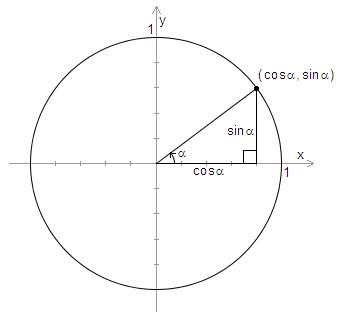
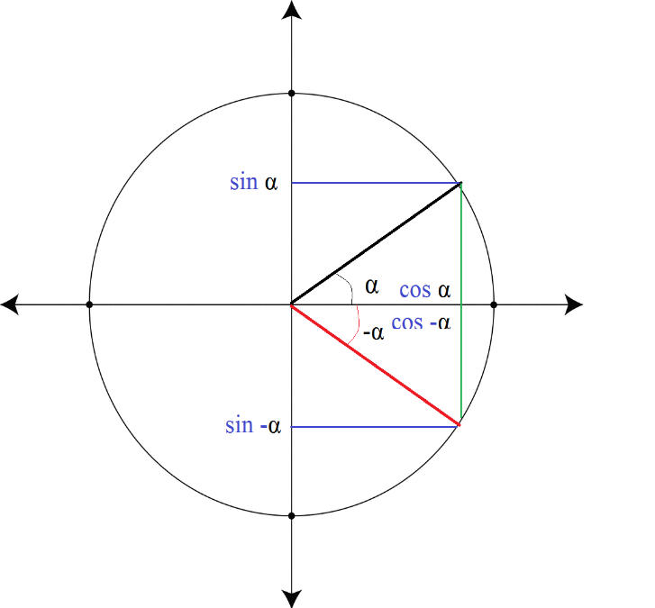

# Yleiset trigonometriset funktiot

Trigonometriset funktiot sini, kosini ja tangentti voidaan määritellä myös sellaiselle kulmille, jotka eivät sijaitse kolmioissa. Suorakulmaisessa kolmiossa trigonometriset funktiot määriteltiin kolmion sivujen pituuksien suhteina. Yleisesti nämä funktiot määritellään ns. yksikköympyrän avulla. 

Yksikköympyrä on $(x,y)$-koordinaatistossa oleva ympyrä, jonka keskipiste on (0,0) ja säde 1. Kun yksikköympyrälle piirretään kulma, niin positiivinen kulman suuruus määritellään yksikköympyrän positiiviselta $x$-akselilta vastapäivään. Kulman toinen kylki on $x$-akselin positiivisella puolella. Kulman toinen kylki leikkaa ympyrän kehän, ja leikkauspisteen koordinaatit ovat $(\cos{\alpha}, \sin{\alpha})$.

 

Yksikköympyrä jaetaan neljään neljännekseen I-IV. Sini ja kosini voivat saada samoja arvoja yksikköympyrän eri neljänneksissä. Neljännekset on esitetty seuraavan esimerkin yhteydessä olevassa kuvassa. Tietyn neljänneksen sisällä sinin tai kosinin merkki pysyy sama, mutta neljänneksien välillä se voi muuttua. Esimerkiksi II neljänneksessä sinin arvot ovat positiivisia ja kosinin arvot negatiivisia, sillä tuon neljänneksen alueella ollaan $x$-akselin yläpuolella (eli $y>0$) ja $y$-akselin vasemmalla puolella (eli $x < 0$).

**Esim.** Erään kulman sini on 0.5. 
 
a) Mihin kohti yksikköympyrää kulman toinen kylki voi sijoittua?

b) Kuinka suuri on kyseinen kulma?

:::{admonition} Vastaus
:class: tip, dropdown

a) Koska sini on positiivinen, kulman toisen kyljen on oltava I tai II neljänneksessä. Kuvaan on merkitty mahdolliset kulmat $\alpha$ ja $\beta$.

b) Yksi vastaus saadaan laskemalla $\alpha=\arcsin{0.5}=30^{\circ}$.

Toinen vastaus saadaan päättelemällä kuvan avulla: $\beta=180^{\circ}-\alpha=180^{\circ}-30^{\circ}=50^{\circ}$.
 
:::
 
Yleisesti pätevät seuraavat laskusäännöt:

- $\sin^2{\alpha}+\cos^2{\alpha}=1$
- $\sin⁡{(180^{\circ}-\alpha)}=\sin⁡{\alpha}$
- $\sin{(-\alpha)}=-\sin{⁡(-\alpha)}$
- $\cos⁡{\alpha}=cos⁡{(-\alpha)}$
- $\cos⁡{(180^{\circ}-\alpha)}=-\cos⁡{\alpha}$
- $\sin{2\alpha} = 2 \sin{\alpha}\cos{\alpha}$
- ja monia muita vastaavia.

Ensimmäinen kaava on suoraan johdettavissa Pythagoraan lauseesta. Muut voidaan perustella piirtämällä kulmia yksikköympyrään. Perustellaan esimerkiksi säännöt $\sin{(-\alpha)}=-\sin{⁡(-\alpha)}$ ja $\cos⁡{\alpha}=\cos⁡{(-\alpha)}$:

 
Kun yksikköympyrässä kierretään jostakin kulmasta $\alpha$ eteenpäin $n$ kertaa täysi kierros, sinin ja kosinin arvo on sama kuin alkuperäisessä kulmassa. Täysi kierros voidaan ilmaista 360 asteena, mutta yleisemmin se ilmaistaan radiaaneina muodossa $2\pi$. Siis 

$\sin⁡{\alpha}=\sin⁡{(\alpha+n\cdot 2\pi)}, \cos⁡{\alpha}=\cos⁡{(\alpha+n\cdot 2\pi)}$.

