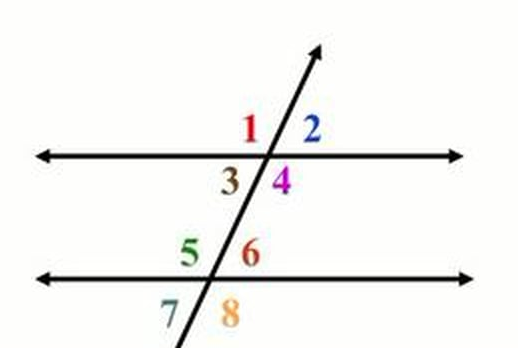
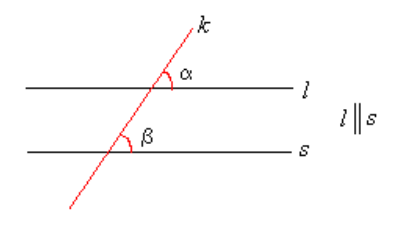

<!-- #region -->
# Trigonometriaa

Useimmat geometriset ongelmat sisältävät kulmia. Jos muuttokuormasta kannetaan suurta lipastoa kapeassa käytävässä, on mahdollista, että lipaston kanssa on vaikeaa tai mahdotonta mahtua kääntymään kulmassa. Tällaisesta haasteesta selviää kokeilemallakin. Sen sijaan rakennuksiin ja kartoitukseen liittyvät mittaukset vaativat teoreettistakin tietoa kulmista, eli trigonometriaa. Perehdytään aluksi kulmiin liittyviin mittayksiköihin ja käsitteisiin.

## Kulmiin liittyviä käsitteitä

Kuvassa on esimerkkejä kulmista piirrettynä ns. yksikköympyrälle. Jokaisen kulman oikea kylki on jana pisteestä A pisteeseen B, ja vasen kylki on jana pisteestä A pisteeseen C, D, E tai F.

Kulmat nimetään usein kreikkalaisilla kirjaimilla $\alpha, \beta, \gamma, \delta, \ldots$. Kirjaimien nimiä voi tarkistaa esim. osoitteesta https://www.rapidtables.org/fi/math/symbols/greek_alphabet.html 

Merkitään nyt yleisesti kulmaa kirjaimella $\alpha$. Kulman suuruudesta riippuen kulma on

- terävä, jos $0^{\circ} \leq \alpha \leq 90^{\circ}$
- suora, jos $\alpha = 90^{\circ}$
- tylppä, jos $90^{\circ} \leq \alpha \leq 180^{\circ}$
- kovera, jos $90^{\circ} \leq \alpha \leq 180^{\circ}$
- oikokulma, jos $\alpha = 180^{\circ}$
- kupera, jos $180^{\circ} \leq \alpha \leq 360^{\circ}$

**Ristikulmat** (alla olevassa kuvassa 1 ja 4; 2 ja 3; ...) ovat yhtä suuria. Niiden kyljet muodostuvat kahdesta toisensa leikkaavasta janasta tai suorasta.

**Vieruskulmien** (alla olevassa kuvassa 1 ja 2; 1 ja 3; ...) summa on $180^{\circ}$. Vieruskulmilla on yksi yhteinen kylki (toisen kulman vasen kylki on sama kuin toisen kulman oikea kylki), ja yksi jana tai suora muodostaa kulmien toiset kyljet.
 

 
Jos kahden koveran kulman samannimiset kyljet ovat yhdensuuntaisia tai keskenään kohtisuorassa, kulmat ovat yhtä suuria. Tällaisia kulmia kutsutaan nimellä **samankohtaiset kulmat**.

**Esim.** Kuvan kulmat $\alpha$ ja $\beta$ ovat yhtä suuret, sillä niiden oikeat kyljet $l$ ja $s$ ovat yhdensuuntaiset (tätä merkitään $l||s$) ja vasemmat kyljet ovat yhdensuuntaiset (sama suora $k$ muodostaa kummankin kulman vasemman kyljen). 

## Kulmayksiköitä

Kulmien suuruuksia mitataan usealla eri yksiköllä.

**Asteet** määritellään siten, että täysi kierros on $360^{\circ}$. Asteita voidaan esittää desimaalilukuina, esim. $35.76^{\circ}$. 

Koordinaateissa tavallinen asteiden esitysmuoto on minuuttien ja sekuntien avulla:

- 1 minuutti = 1/60 astetta, merkitään 1’ 
- 1 sekunti = 1/60 minuuttia = 1/3600 astetta, merkitään 1’’

**Esim.** Muuta $87^{\circ}~56'~28''$ desimaaliluvuksi.

:::{admonition} Ratkaisu
:class: tip, dropdown
$87^{\circ}~56'~28''$ tarkoittaa $(87+\frac{56}{60}+\frac{28}{3600})^{\circ} \approx 87.94^{\circ}$.
:::

**Esim.** Muuta $56.72^{\circ}$ asteiksi, minuuteiksi ja sekunneiksi.

:::{admonition} Ratkaisu
:class: tip, dropdown

Kokonaisia asteita on 56. Merkitään minuuttien määrää $x$ ja kirjoitetaan desimaaliosa 0.72 minuutteina: $0.72=\frac{x}{60}$. Tästä saadaan ratkaisua $x=0.72\cdot 60=43.2$.

Kokonaisia minuutteja on siis 43. Lisäksi jää 0.2 minuuttia. Merkitään nyt sekuntien määrää $y$ ja kirjoitetaan minuuttien desimaaliosa sekunteina: $0.43 = \frac{y}{60}$. Sekuntien määräksi saadaan $y=0.2\cdot 60=12$.

Kulma voidaan siis esittää muodossa $56^{\circ}~43'~12''$.
:::

**Gooni** on määritelty seuraavasti: $100~\text{gon}=90^{\circ}$. Määritelmästä saadaan johdettua muunnoskaavat 

- $1~\text{gon} = \left(\frac{90}{100}\right)^{\circ} = 0.9^{\circ}$
- $1^{\circ}=\frac{100}{90}~\text{gon} \approx 1.11 \ldots~\text{gon}$. 

**Esim.** $12~\text{gon} = 12\cdot 0.9^{\circ}=10.8^{\circ}$

**Esim.** $72.5^{\circ}=72.5 \cdot \frac{100}{90}~\text{gon} \approx 80.56~\text{gon}$

**Radiaani** on tärkeä yksikkö, sillä laskimet ja laskentaohjelmistot usein käyttävät oletusarvoisesti sitä. Radiaanit määritellään siten, että täysi kierros on $2\pi$ ja oikokulma on $\pi$. Luku $\pi$ (pii) on päättymätön desimaaliluku, ja sen likiarvo on 3.14159... Käytä laskuissa mieluummin laskimen $\pi$/PI -näppäintä, tai WolframAlphassa kirjoita luku muodossa ”pi”.

Radiaanien ja asteiden välinen yhteys saadaan yhtälöstä $\pi~\text{rad} = 180^{\circ}$.

Joillekin kulmille muunnoskaavan tuloksena on tarkat, murtolukumuotoiset arvot, esimerkiksi seuraavat:
- $90^{\circ}=\frac{\pi}{2}$
- $60^{\circ}=\frac{\pi}{3}$
- $45^{\circ}=\frac{\pi}{4}$
- $30^{\circ}=\frac{\pi}{6}$

**Esim.** Muunna radiaaneiksi $137.2^{\circ}$. 

:::{admonition} Ratkaisu
:class: tip, dropdown

Määritelmän mukaan $\pi~\text{rad} = 180^{\circ}$, josta voidaan ratkaista $1^{\circ} = \frac{\pi}{180}~\text{rad}$, joten $137.2^{\circ}=137.2\cdot \frac{\pi}{180}~\text{rad} \approx 2.395~\text{rad}$.

:::

**Esim.** Muunna asteiksi 0.25 radiaania.

:::{admonition} Ratkaisu
:class: tip, dropdown

Koska $\pi~\text{rad} = 180^{\circ}$, niin $1~\text{rad} =\frac{180^{\circ}}{\pi}$, joten $0.25~\text{rad}=0.25\cdot \frac{180^{\circ}}{\pi} \approx 14.32^{\circ}$. 

:::