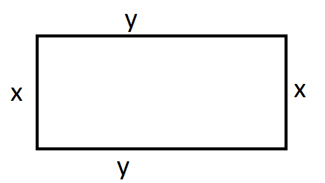

# Toisen asteen yhtälöt

Yhtälö, joka saadaan muokattua muotoon $ax^2+bx+c=0$, on toisen asteen yhtälö. Yhtälö ei suoraan ratkea samoilla menetelmillä kuin ensimmäisen asteen yhtälö, mutta yhtälölle on mahdollista johtaa ratkaisukaava:

$\Large{x=\frac{-b\pm\sqrt{b^2-4ac}}{2a}}$

:::{admonition} Ratkaisukaavan perustelu
:class: tip, dropdown

Aloitetaan kaavan johtaminen toisen asteen yhtälön perusmuodosta $ax^2+bx+c=0$. Jaetaan molemmat puolet luvulla $a$. Näin voi tehdä, sillä oletetaan, että $a\neq 0$. Oikealle puolelle jää nolla, sillä nolla jaettuna millä tahansa (nollasta poikkeavalla) luvulla on edelleen nolla.

$x^2+\frac{b}{a}x+\frac{c}{a}=0$

Vähennetään molemmilta puolilta $\frac{c}{a}$, jotta saadaan vasemmalle puolelle vain sellaisia termejä, joissa on mukana tuntematon $x$.

$x^2+\frac{b}{a}x=-\frac{c}{a}$

Seuraavaksi pyritään saamaan vasen puoli muotoon $(x+m)^2$, missä $m$ on jokin luvuista $a$ ja $b$ muodostuva kerroin. Toimenpiteen tarkoitus on, että lopulta voitaisiin ottaa yhtälöstä puolittain neliöjuuri, jonka jälkeen vasemmalle jää vain $x+m$.

Binomikaavoista muistetaan, että lauseke $(x+m)^2$ voidaan purkaa muotoon $x^2+2mx+m^2$. Kun verrataan tätä lausekkeeseen $x^2+\frac{b}{a}x$, todetaan, että $2m=\frac{b}{a}$, eli toisin sanoen $m=\frac{b}{2a}$. Yhtälön molemmille puolille pitää vielä lisätä $m^2$ eli $\left(\frac{b}{2a}\right)^2$, joka sievenee muotoon $\frac{b^2}{4a^2}$.

Nyt yhtälö on siis muotoa

$x^2+\frac{b}{a}x+\frac{b^2}{4a^2}  = - \frac{c}{a}+\frac{b^2}{4a^2}$

ja vasen puoli voidaan kirjoittaa lyhyemmin:

$\left(x+\frac{b}{2a}\right)^2=-\frac{c}{a}+\frac{b^2}{4a^2}$

Jos tämä on vaikea uskoa, avaa yhtälön vasen puoli binomikaavan avulla. Oikealla puolella voidaan vielä vaihtaa järjestystä:

$\left(x+\frac{b}{2a}\right)^2=\frac{b^2}{4a^2}-\frac{c}{a}$

Yhtälön ratkaisu jatkuu helposti ottamalla neliöjuuri molemmista puolista. Neliöjuuri kelpaa sekä plus- että miinusmerkkisenä (käänteisesti: kun luku korotetaan potenssiin kaksi, luvun etumerkillä ei ole väliä, koska lopputulos on kuitenkin aina positiivinen). 

$x+\frac{b}{2a}=\pm\sqrt{\frac{b^2}{4a^2}-\frac{c}{a}}$

Ratkaistaan yhtälöstä $x$:

$x=\pm\sqrt{\frac{b^2}{4a^2}-\frac{c}{a}}-\frac{b}{2a}$

Sievennetään neliöjuuren sisällä oleva lauseke laventamalla termi $-\frac{c}{a}$ luvulla $4a$:

$x=\pm\sqrt{\frac{b^2}{4a^2}-\frac{4ac}{4a^2}}-\frac{b}{2a}$

Neliöjuuren sisällä olevat termit voi yhdistää, sillä nyt niissä on sama nimittäjä:

$x=\pm\sqrt{\frac{b^2-4ac}{4a^2}}-\frac{b}{2a}$

Neliöjuuren sisällä oleva jakolasku voidaan esittää kahden neliöjuuren jakolaskuna:

$x=\pm\frac{\sqrt{b^2-4ac}}{\sqrt{4a^2}}-\frac{b}{2a}$

Alempi neliöjuuri häviää sieventämällä:

$x=\pm\frac{\sqrt{b^2-4ac}}{2a}-\frac{b}{2a}$

Koska oikean puolen termeissä on sama nimittäjä $2a$, ne voidaan yhdistää. Samalla voidaan kirjoittaa oikean puolen termit eri järjestyksessä:

$x = \frac{-b\pm\sqrt{b^2-4ac}}{2a}$

:::

::::{admonition} Esimerkki

Ratkaise yhtälö $2x^2-8x+6=0$.

:::{admonition} Ratkaisu
:class: tip, dropdown

Yhtälöstä saadaan ratkaisukaavaan kertoimet $a=2$, $b=-8$, $c=6$. Sijoitetaan ne kaavaan:

$x=\frac{-(-8)\pm\sqrt{(-8)^2-4\cdot 2 \cdot 6}}{2\cdot 2}$

$x=\frac{8\pm\sqrt{64-48}}{4}$

$x=\frac{8\pm\sqrt{16}}{4}$

$x=\frac{8\pm 4}{4}$

Saadaan kaksi ratkaisua:

$x=\frac{8+4}{4}=\frac{12}{4}=3$ ja $x=\frac{8-4}{4}=\frac{4}{4}=1$.

:::

::::

::::{admonition} Esimerkki

Ratkaise yhtälö $\frac{4}{x}+x=8-2x$.

:::{admonition} Ratkaisu
:class: tip, dropdown

Yhtälö täytyy ensin muokata perusmuotoon, jotta saadaan poimittua ratkaisukaavaan kertoimet $a,b$ ja $c$. Aloitetaan kertomalla yhtälön molemmat puolet luvulla $x$:

$4+x^2=8x-2x^2$

Lisätään molemmille puolille $2x^2$:

$4+3x^2=8x$

Vähennetään molemmilta puolilta $8x$ ja järjestellään termejä:

$3x^2-8x+4=0$

Nyt kertoimet ovat $a=3$, $b=-8$ ja $c=4$. Ratkaisuksi saadaan 

$x=\frac{-(-8)\pm\sqrt{(-8)^2-4\cdot 3 \cdot 4}}{2\cdot 3} = \frac{8\pm\sqrt{64-48}}{6}= \frac{8\pm 4}{6}$.

Ratkaisut ovat $x=\frac{8+4}{6}=\frac{12}{6}=2$ ja $x=\frac{8-4}{6}=\frac{4}{6}=\frac{2}{3}$.

:::

::::

## Diskriminantti ja ratkaisujen määrä

Toisen asteen yhtälöitä ratkaistessaan saattaa päätyä hämmentävään tilanteeseen, jossa ratkaisua ei löydykään tai niitä löytyy kaksi. Näin voi tapahtua esimerkiksi fysiikan ongelmissa. Esimerkiksi jos heitetään lumipallo korkeassa kaaressa kohti matalaa rakennusta, voidaan laskea, milloin tai missä kohtaa lumipallo osuu rakennuksen katolle. Lumipallon sijaintia kuvataan toisen asteen yhtälöllä. Jokainen, joka on joskus heittänyt lumipallon, tietää että aina pallo ei osu sinne minne olisi tarkoitus. Tämä vastaa tilannetta, jossa yhtälölle ei löydy ratkaisua. Toisaalta tarkka heittäjä saa pallon hipaisemaan sekä katon etu- että takareunaa, jolloin yhtälölle on kaksikin ratkaisua. 

Joskus käytännön sovelluksissa itse yhtälön ratkaisu ei ole tärkein asia. Kun suunnitellaan jotakin laitetta, rakennusta tai muuta systeemiä, hyvä lähtökohta on miettiä, onko kyseisen systeemin avulla edes mahdollista saavuttaa haluttua asiaa. Toisin sanoen - onko olemassa ratkaisuja sille yhtälölle, jolla systeemin toimintaa mallinnetaan. Jos ei ole, niin mitä parametrejä systeemissä pitäisi muuttaa? Pitäisikö lumipallo heittää kauempaa, lähempää, suuremmassa vai pienemmässä kulmassa?

Mahdollisten ratkaisujen lukumäärää tarkastellaan diskriminantti-käsitteen avulla. Diskriminantti $D$ tarkoittaa toisen asteen yhtälön ratkaisukaavassa neliöjuuren sisällä olevaa lauseketta $b^2-4ac$. Diskriminantin arvosta nähdään, onko yhtälöllä 0, 1 vai 2 ratkaisua seuraavien sääntöjen mukaan

- Jos $D < 0$, niin neliöjuurta $\sqrt{D}$ ei ole määritelty. Tällöin yhtälöllä ei ole yhtään ratkaisua.

- Jos $D = 0$, niin neliöjuuren arvo on $\sqrt{D}=0$ ja ratkaisukaava pelkistyy muotoon $x=-\frac{b}{2a}$. Yhtälölle löytyy siis tasan yksi ratkaisu.

- Jos $D > 0$, niin neliöjuuresta saadaan jokin luku $\sqrt{D}$ sijoitettavaksi ratkaisukaavaan. Yhtälölle on olemassa kaksi ratkaisua.

::::{admonition} Esimerkki

Millä luvun $b$ arvolla tai arvoilla yhtälöllä $5x^2+bx+80=0$ on tasan yksi ratkaisu?

:::{admonition} Ratkaisu
:class: tip, dropdown

Kirjoitetaan yhtälölle diskriminantti $D=b^2-4\cdot 5\cdot 80$, joka sievenee muotoon $D=b^2-1600$. Ratkaisuja on tasan yksi silloin, kun $D=0$. On siis ratkaistava $b$ yhtälöstä $b^2-1600=0$. Ratkaisuksi saadaan $b=40$. Myös $b=-40$ toteuttaa saman yhtälön.

On tärkeää huomata, että annettua yhtälöä ei ole vielä ratkaistu. Tarkastellaan erikseen tilanteita $b=40$ ja $b=-40$.

Toisen asteen yhtälön ratkaisukaavalla saadaan ensimmäisessä tapauksessa

$x=\frac{-40\pm 0}{2\cdot 5}=-4$

ja toisessa tapauksessa 

$x=\frac{-(-40)\pm 0}{2\cdot 5}=4$

:::

::::

::::{admonition} Esimerkki

Mikä pitäisi olla luvun $c$, jotta yhtälö $2x^2-x+c=0$ olisi mahdollista ratkaista?

:::{admonition} Ratkaisu
:class: tip, dropdown

Diskriminantti on nyt $D=(-1)^2-4\cdot 2\cdot c$ eli $D=1-8c$. Ratkaisuja on olemassa, jos $1-8c \geq 0$. Tästä saadaan ehto $c \leq \frac{1}{8}$.

Yhtälön ratkaisut riippuvat nyt valitusta luvun $c$ arvosta. Esimerkiksi jos valitaan $c=0$, niin ratkaisut ovat 

$x=\frac{-(-1)\pm\sqrt{(-1)^2-4\cdot 2 \cdot 0}}{2\cdot 2}=\frac{1\pm 1}{4}$ eli $x=\frac{1}{2}$ tai $x=0$.

:::

::::

## Erikoistapauksia

Jos $b=0$, niin yhtälö pelkistyy muotoon $ax^2+c=0$. Tällöin yhtälöstä saadaan ratkaistua $x=\pm \sqrt{\frac{-c}{a}}$. Kaavaa ei kannata opetella ulkoa, sillä se muodostuu vähentämällä molemmilta puolilta luku $c$, jakamalla molemmat puolet luvulla $a$ ja ottamalla molemmista puolista neliöjuuri. Ratkaisuja on olemassa vain, jos $\frac{-c}{a}\geq 0$, sillä muuten neliöjuurta ei voi laskea. 

::::{admonition} Esimerkki

Ratkaise yhtälö $2x^2-18=0$.

:::{admonition} Ratkaisu
:class: tip, dropdown

Lisätään aluksi yhtälön molemmille puolille luku $18$:

$2x^2=18$

Jaetaan yhtälön molemmat puolet luvulla $2$:

$x^2=9$

Otetaan yhtälön molemmista puolista neliöjuuri, huomioiden sekä positiivinen että negatiivinen vaihtoehto

$x=\pm \sqrt{9}$.

Ratkaisut ovat siis $x=3$ ja $x=-3$.

Suoraan ratkaisukaavalla ratkaisu olisi

$x=\pm \sqrt{\frac{-(-18)}{2}}= \pm \sqrt{\frac{18}{2}} = \pm \sqrt{9}$. 

:::

::::

Jos $c=0$, niin yhtälö pelkistyy muotoon $ax^2+bx=0$. Tällöin yhtälön vasemmalla puolella voidaan erottaa $x$ yhteiseksi tekijäksi, ja yhtälö muuttuu muotoon $x(ax+b)=0$. Yhtälö voidaan ratkaista käyttämällä ns. tulon nollasääntöä: jos tulo on nolla, niin väistämättä vähintään yksi sen tekijöistä on nolla. Saadaan siis vaihtoehdot $x=0$ tai $ax+b=0$, josta $x$ ratkaistaan ensimmäisen asteen yhtälön ratkaisukeinoin.

::::{admonition} Esimerkki

Ratkaise yhtälö $x^2+6x=0$.

:::{admonition} Ratkaisu
:class: tip, dropdown

Yhtälön vasemman puolen termien yhteinen tekijä on $x$, joten yhtälö muuttuu muotoon $x(x+6)=0$. Tästä saadaan tulon nollasäännön perusteella vaihtoehdot $x=0$ ja $x+6=0$. Jälkimmäisestä yhtälöstä ratkeaa $x=-6$. Yhtälön $x^2+6x=0$ ratkaisut ovat siis $x=0$ ja $x=-6$.

:::

::::

## Sovelluksia

Toisen asteen yhtälöön päädytään monissa geometrian ongelmissa. Sovellustehtävissä yhtälöt voi hyvin ratkaista esimerkiksi [WolframAlphan](https://www.wolframalpha.com/) solve-toiminnolla. Oleellista on, että on osannut tehtävänannon perusteella muodostaa ratkaistavan yhtälön. Laskimessa yhtälön ei tarvitse olla toisen asteen yhtälön perusmuodossa!

Yksinkertainen esimerkki geometrisesta käsitteestä, josta päädytään toisen asteen yhtälöön, on suorakulmio. Jos suorakulmainen sivujen pituudet ovat $x$ ja $y$, niin sivujen pituuksia ja suorakulmion pinta-alaa $A$ yhdistää yhtälö $A=xy$. Tällöin jos tiedetään toinen sivuista ja pinta-ala, voidaan toinen sivu esittää pinta-alan ja tunnetun sivun avulla. Vastaavasti jos tunnetaan suorakulmion toinen sivu ja ympärysmitta $2x+2y$, voidaan tuntematon sivu esittää tunnetun sivun ja ympärysmitan avulla. Lopuksi päädytään yhtälöön, jossa on vain yksi tuntematon, jolloin yhtälö voidaan ratkaista. 

(Yhtälöparien ratkaisua käsitellään tarkemmin [Lineaarialgebra](https://luma-lapinamk.github.io/minna-lineaarialgebra/yhtaloryhmat_kertaus.html) -materiaaleissa. Tässä tapauksessa ratkaisu tapahtuu ns. sijoitusmenetelmällä.)

::::{admonition} Esimerkki

Suorakulmion muotoisen tontin koko on 600 neliömetriä. Tonttia ympäröi joka puolelta aita, jonka pituus on yhteensä 100 metriä. Mitkä ovat tontin sivujen pituudet?

:::{admonition} Ratkaisu
:class: tip, dropdown

Aloitetaan merkitsemällä tontin sivujen pituuksia joillakin kirjaimilla. Merkitään esimerkiksi lyhyttä sivua $x$ ja pitkää sivua $y$. Kuvan piirtäminenkin voi auttaa:

Pinta-alan perusteella tiedetään, että $x\cdot y y=600$. Aidan pituuden perusteella taas tiedetään, että $2x+2y=100$. 

Jälkimmäisestä yhtälöstä voidaan ratkaista $2y=100-2x \Leftrightarrow y=50-x$.

Sijoittamalla tämä pinta-alan perusteella muodostettuun yhtälöön saadaan $600=x(50-x)$. Tästä saadaan sievennettyä toisen asteen yhtälö $600=50x-x^2$ eli $x^2-50x+600=0$.

WolframAlphalla saadaan ratkaisut $x=30, x=20$. Vastaavasti tällöin $y=50-30=20$ tai $y=50-20=30$. Näissä eri ratkaisuissa mitat ovat samat, mutta tontti on vain eri päin.

Yhtälön voi ratkaista kirjoittamalla solve-komennon perään yhtälön $600=x(50-x)$, eli yhtälöä ei tarvitse muokata toisen asteen yhtälön perusmuotoon!

:::

::::