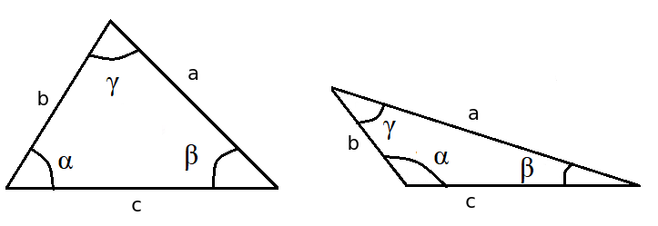
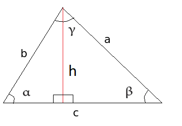
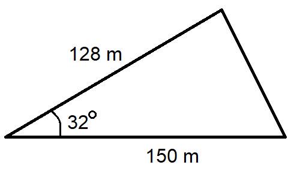

# Yleiset kolmiot

Yleisessä eli vinokulmaisessa kolmiossa kaikki kulmat voivat olla teräviä, tai yksi kulma on tylppä ja kaksi teräviä. Kolmio pitää olettaa vinokulmaiseksi, jos ei ole erikseen kerrottu, että se on suorakulmainen. Tässä kappaleessa esitellään yleiset ehdot kolmion sivujen pituuksille ja opitaan laskemaan minkä tahansa kolmion pinta-ala. 

 
## Kolmioepäyhtälöt

Kolmioepäyhtälöiden avulla voidaan tarkistaa, onko kyseessä ylipäätään kolmio. Kolmion kaikkien sivujen pitää yltää yhdistymään toisiinsa! Voit testata tätä konkreettisesti vaikka taivuttamalla rautalangan pätkää kahdesta eri kohdasta ja kääntämällä reunimmaiset osat yhteen. Matematiikan merkinnöin asia ilmaistaan siten, että jos sivujen pituudet ovat $a$, $b$ ja $c$, on seuraavien epäyhtälöiden oltava voimassa:

(1) $a+b>c$

(2) $a+c>b$

(3) $b+c>a$

::::{admonition} Esimerkki

Voivatko kolmion sivujen pituudet olla $a=20$, $b=40$ ja $c=50$?

:::{admonition} Ratkaisu
:class: tip, dropdown

Tarkistetaan, ovatko kaikki kolme kolmioepäyhtälöä voimassa:

(1) $a+b=20+40=60,60>50$, OK

(2) $a+c=20+50=70,70>40$, OK

(3) $b+c=40+50=90,90>20$, OK

Kaikki epäyhtälöt toteutuvat, joten kolmion sivujen pituudet ovat mahdolliset.

:::

::::

::::{admonition} Esimerkki

Millä luvun $a$ arvoilla janoista, joiden pituudet ovat $a$, $a+3$ ja $a+5$ voi muodostaa kolmion?

:::{admonition} Ratkaisu
:class: tip, dropdown

Ratkaistaan epäyhtälöt: 

(1) $a+a+3>a+5 \leftrightarrow 2a+3>a+5 \leftrightarrow 2a-a>5-3 \leftrightarrow a>2$

(2) $a+a+5>a+3 \leftrightarrow 2a+5>a+3 \leftrightarrow 2a-a>3-5 \leftrightarrow a>-2$

(3) $a+3+a+5>a \leftrightarrow 2a+8>a \leftrightarrow 2a-a>-8 \leftrightarrow a>-8$.

Ehdot (2) ja (3) täyttyvät kaikilla mahdollisilla sivun pituuksilla, sillä sivujen pituudet ovat varmasti positiivisia. Rajoitteeksi jää ehto (1) eli on oltava $a>2$.

:::

::::

## Yleisen kolmion pinta-ala

Kolmion pinta-alan $A$ voi laskea seuraavalla kaavalla: $A=\frac{1}{2} bc \sin{\alpha}$, missä $b$ ja $c$ ovat mitkä tahansa kaksi kolmion sivua, ja $\alpha$ niiden välinen kulma.
 
:::{admonition} Perustelu
:class: tip, dropdown

Kuvan kolmiossa korkeus $h$ saadaan hyödyntämällä suorakulmaisen kolmion trigonometriaa kolmioon, joka muodostuu piirtämällä vinokulmaiseen kolmioon korkeusjana $h$. Kuvan tapauksessa kolmion kantana on sivu $c$.

Sinin määritelmän mukaan $sin{\alpha}=\frac{h}{b}$, josta saadaan $h=b \sin{\alpha}$. Siis ala on $A=\frac{ch}{2}=\frac{1}{2} bc \sin{\alpha}$.

Vastaavasti ala voidaan määritellä piirtämällä korkeusjana mistä tahansa kolmion kärjestä vastaavalla kannalle.
:::

::::{admonition} Esimerkki

Laske kuvan kolmion pinta-ala.

:::{admonition} Ratkaisu
:class: tip, dropdown

Pinta-ala on $A=\frac{1}{2}\cdot 150~\text{m}\cdot 128~\text{m}\sin{32^{\circ}}=5087~\text{m}^2$.

:::

::::
 
Minkä tahansa kolmion pinta-ala $A$ voidaan laskea myös ns. Heronin kaavan avulla: $A=\sqrt{d(d-a)(d-b)(d-c)}$, missä $a, b, c$ ovat kolmion sivujen pituudet ja $d=\frac{1}{2}(a+b+c)$ on kolmion piirin eli ympärysmitan puolikas.

Heronin kaavan perustelu löytyy esimerkiksi [Matematiikkalehti Solmusta](https://matematiikkalehtisolmu.fi/2011/2/heron.pdf).

::::{admonition} Esimerkki

Kolmion sivujen pituudet ovat 2, 3 ja 4. Laske pinta-ala.

:::{admonition} Ratkaisu
:class: tip, dropdown 

Lasketaan ensin kolmion piirin puolikas: $d=\frac{1}{2}\cdot (2+3+4)=\frac{9}{2}=4.5$
Pinta-ala saadaan sijoittamalla laskettu luku ja annetut sivujen pituudet Heronin kaavaan.

$A=\sqrt{(4.5\cdot (4.5-2)\cdot (4.5-3)\cdot (4.5-4)}$

$A=\sqrt{4.5\cdot 2.5 \cdot 1.5 \cdot 0.5}$

$A=\sqrt{8.4375}=2.9$

:::

::::